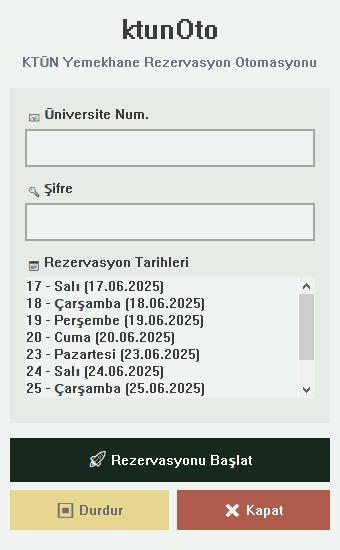

<div align="center">
  
  <h1>ktunOto</h1>
  <strong>🤖 KTÜN Yemekhane Rezervasyon Otomasyonu 👾</strong>
  <p>Konya Teknik Üniversitesi yemekhane rezervasyon çilesine son.</p>
  
  <p>
    <a href="LICENSE">
    </a>
    
    
  </p>
</div>

**ktunOto**, Konya Teknik Üniversitesi (KTÜN) *Yemekhane Rezervasyon Sistemi* için geliştirilmiş, rezervasyon sürecini otomatikleştiren bir masaüstü uygulamasıdır. Üniversitenin yavaş ve kullanışsız web sitesiyle uğraşmak yerine, bu araç ile yemekhane rezervasyonlarınızı saniyeler içinde yapabilirsiniz.

<div align="center">
  
</div>

---

## ✨ Temel Özellikler

- **Tek Tıkla Rezervasyon:** Arayüzden istediğiniz günleri seçerek tek tıkla rezervasyon talebi gönderir.
- **Otomatik Giriş:** Üniversite numaranız ve şifrenizle sisteme anında giriş yapar.
- **Otomatik Ödeme:** Daha önce güvenli bir şekilde kaydettiğiniz kart bilgilerinizle ödeme formunu otomatik olarak doldurur.
- **Güvenli Bilgi Saklama:** Kredi kartı bilgileriniz, bilgisayarınızda AES şifreleme standardı kullanılarak **yerel olarak** saklanır ve asla dışarıyla paylaşılmaz.
---
## 🚀 Kurulum ve Kullanım

### 1. Kurulum
1.  Projenin **[Releases](https://github.com/c4kar/ktunOto/releases)** sayfasına gidin.
2.  En son sürümün altındaki `ktunOto.exe` dosyasını indirin.
3.  İndirdiğiniz `.exe` dosyasını çalıştırın. Kurulum bu kadar!([setup_cc.py](https://raw.githubusercontent.com/c4kar/ktunOto/refs/heads/main/setup_cc.py) dosyasını çalıştırmayı unutmayın)

### 2. İlk Ayarlar
- **Kart Bilgileri:** Programı ilk kez çalıştırdığınızda, sizden kart bilgilerinizi girmenizi isteyecektir. Bu bilgiler, gelecekteki rezervasyonlarda ödeme formunu otomatik doldurmak için **bilgisayarınızda şifrelenerek** saklanır.
- **Sürücü İndirmesi:** Yine ilk çalıştırmada, program bilgisayarınızdaki Chrome tarayıcısıyla uyumlu sürücüyü bir defaya mahsus indirecektir. Bu işlem biraz sürebilir.

### 3. Rezervasyon Yapma
1.  Uygulamayı açın.
2.  Üniversite numaranızı ve şifrenizi ilgili alanlara girin.
3.  Takvimden rezervasyon yapmak istediğiniz günleri seçin.
4.  **"Rezervasyonu Başlat"** butonuna tıklayın.
5.  Program sizden **CAPTCHA** ve **SMS** kodlarını girmenizi istediğinde ilgili kodları girin.
6.  Afiyet olsun :)

---
## Tavsiye edilen kurulum
En kolay yöntem budur. Aşağıdaki komutu terminalde çalıştırmanız yeterli. Gerekli her şey otomatik olarak kurulacaktır.

```bash
git clone https://github.com/c4kar/ktunOto
cd ktunOto
py installer.py 
```

## 👨‍💻 Geliştiriciler İçin Manuel Kurulum

Eğer projeyi kaynak kodundan çalıştırmak veya geliştirmek isterseniz:

1.  **Projeyi Klonlayın:**
    ```bash
    git clone https://github.com/c4kar/ktunOto.git
    cd ktunOto
    ```
2.  **Sanal Ortam Oluşturun ve Aktifleştirin:**
    ```bash
    # Sanal ortamı oluştur
    python -m venv venv
    # Windows'ta aktifleştir
    .\venv\Scripts\activate
    ```
3.  **Bağımlılıkları Yükleyin:**
    ```bash
    pip install -r requirements.txt
    ```
4. **Kart bilgilerini girin**
   ```bash
    python setup_cc.py 
    ```
5. **Uygulamayı Çalıştırın:**
    ```bash
    python main.py
    ```

---

## 🤝 Katkıda Bulunma
Projeyi daha iyi hale getirmek için tüm katkılara açığım! Lütfen bir "pull request" oluşturun veya "issue" açarak fikirlerinizi ve bulduğunuz hataları paylaşın.

## ☑️ Yapılacaklar
- [x] Enkripte kart bilgileri saklama
- [ ] "Onayla" tuşu stabilitesi
- [ ] Günün yemeğini GUI'da inceleyebilme
- [ ] istatik
- [ ] WEB


